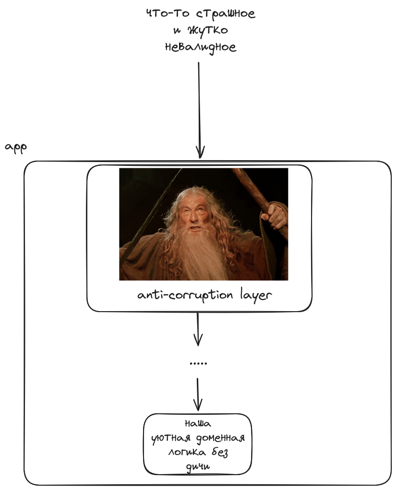

# Защитное программирование

**Defensive programming** (оборонительное, защитное программирование) — принцип разработки ПО, при котором разработчики пытаются учесть возможные ошибки и сбои, максимально изолировать их и при возможности восстановить работоспособность программы в случае неполадок.

Что важно: часто защищаться надо от самих себя, ведь мы сами как разработчики можем сделать наш код хрупким.
Высший пилотаж — создать такие условия, чтобы ошибки и не возникали.

Хоть это и не совсем догматично, но практиками защитного программирования можно считать все приёмы, которые делают наш код "честнее" и предсказуемее — чем меньше сайд-эффектов, непрозрачных контрактов, неожидаемого поведения, тем легче предусмотреть поведение программы.
Говоря проще, защитное программирование — это в том числе о том, как "не стрелять самому себе в ногу" собственными решениями.

## Неидеальный внешний мир, легаси, рефакторинг и все-все-все

Начать нужно с того, что большая часть "защиты" нужна именно на границах наших сервисов. Пользовательский ввод, невалидные данные, некорректное использование API — всё это должно отсекаться задолго до основного ядра нашего приложения.
Такой защитный слой на границах наших сервисов даёт нам уверенность в том, что всему прошедшему сквозь него мы можем доверять.



Это также относится и к внешним библиотекам, легаси-модулям или чему угодно. Тут на помощь могут прийти такие паттерны как Wrapper, Adapter, Facade и прочие [подобные](https://www.baeldung.com/cs/wrapper-class).

## Fail-Fast vs Fail-Safe

Fail-Fast — "упасть" в исключительном случае как можно скорее. Направлено на то, чтобы узнать о проблеме как можно быстрее и избежать возможных последствий обработки в исключительных условиях.
Применяется для конфигурации, жёстких правил валидации, работы с критичными данными.

Fail-Safe — не "упасть" вовсе, мягко обработать исключительную ситуацию, например, в ущерб работы какой-то конкретной функциональности. Позволяет повысить отказоустойчивость, пожертвовав частью функциональности.
Применяется в целом для отказустойчивых и высокодоступных сервисах, в сервисах, которые взаимодействуют с пользователем через UI. См. "fault tolerance", "graceful degradation".

## Exceptions

Хоть сейчас есть и более совершенные практики работы с "исключительными" ситуациями, Exceptions (исключения) всё равно остаются одной из основных конструкций современных языков, поэтому нужно уметь их эффективно использовать.

Проблема исключений в том, что они являются некоторым неявным контрактом (если речь не о checked exception, но у них и своих проблем хватает, особенно в плане удобства использования с современными фичами языкап), и по умолчанию делают взаимодействие внутри программы менее
прозрачным.

Главное правило - исключения созданы для исключительных ситуаций.

### Не используйте исключения там, где без них можно обойтись

Во многих случаях можно обойтись простыми типами, особенно когда ситуация ни в коем случае не исключительная, вполне ожидаемая. Например, если вполне ожидаемо, что некоторая работа может завершиться неуспешно — это не исключение, стоит включить это в контракт взаимодействия.
В таком случае мы получим прозрачность и расширяемость.

```java
public static void main(String[] args) {
    // вполне можно было спроектировать doWork так, чтобы он выбрасывал исключение
    // и нам пришлось бы его обрабатывать
    WorkResult easyWorkResult = worker.doWork(new EasyWork());
    WorkResult hardWorkResult = worker.doWork(new HardWork());
}
```

[Полный пример](./src/main/java/com/example/demo/exceptions/SimpleTypeInsteadOfException.java)

### Не используйте исключения как goto

Не нужно использовать Exception как инструмент управления потоком исполнения программы, это только запутает и сделает программу нечитаемой.
Для управления потоком исполнения мы можем использовать условные конструкции, типы и другие инструменты языка.

```java
public void doSomethingUgly(String input) {
        try {
            step1(input);
        } catch (GotoException e) {
            try {
                step2(input);
            } catch (GotoException ex) {
                try {
                    step3(input);
                } catch (GotoException exc) {
                    System.err.println("Всё успешно сломалось: " + exc.getMessage());
                }
            }
        }
    }
```

[Полный пример](./src/main/java/com/example/demo/exceptions/GotoExceptionExample.java)

## Guard clause

Guard clause ("граничный оператор") — способ не пропустить невалидные данные в метод по принципу fail-fast, избежав ветвления в методе.

```java
// вариант доменной валидации через исключения и guard clause
public void processOrder(Order order) {
    if (order.getItems().isEmpty()) {
        throw new EmptyOrderException("Нельзя сделать пустой заказ");
    }
    if (!order.isPaid()) {
        throw new UnpaidOrderException("Нельзя обработать неоплаченный заказ");
    }

    processItems(order.getItems());
    shipOrder(order);
}
```

## Работа с null

Null References (The Billion Dollar Mistake) — работа с null'ами вызывает проблемы с момента их появления.
Некоторые практики, которые помогут меньше страдать.

### Используй средства языка и библиотеки

Многие средства языков направлены на борьбу или более удобную работу с null:
- [null-safety](https://kotlinlang.org/docs/null-safety.html) в Kotlin;
- [Optional](https://docs.oracle.com/javase/8/docs/api/java/util/Optional.html) в Java;
- аннотации сторонних библиотек, например, `@NotNull` библиотеки `org.jetbrains.annotations`.

```java
// Optional позволяет запускать цепочки обработки вне зависимости от того, пришёл ли на вход null
// или валидное значение
var optional = Optional.ofNullable(possibleNullValue).map(x -> x.getInnerValue()).filter(x -> x != 7);
```

### Доверяй себе, не проверяй повторно

Как упоминалось [выше](README.md#неидеальный-внешний-мир-легаси-рефакторинг-и-все-все-все), у вас должен быть некоторый защитный слой, от которого приходит уже провалидированная и "чистая" модель, ей стоит доверять.
Относится это не только к null'ам, но особенно помогает именно с ними.

[Пример](./src/main/java/com/example/demo/npe/acl/UserACL.java) - пример упрощённый, но важно понять суть.

## Сайд-эффекты и состояние

Сайд-эффекты — ещё одна неявная и непрозрачная вещь, которая может ломать наши программы. Лучше лимитировать их количество, и оставить их там, где без них никак: внешние вызовы и взаимодействия, логирование и пр.

Состояние — сложная вещь, в которой можно допустить большое количество ошибок. Опять же, лучше стараться делать объекты без сложного изменяемого состояния.

## Make illegal states unrepresentable

Старайтесь спроектировать свои типы так, чтобы они не могли быть в невалидном состоянии.

https://inside.java/2024/06/03/dop-v1-1-illegal-states/
https://fsharpforfunandprofit.com/posts/designing-with-types-making-illegal-states-unrepresentable/

